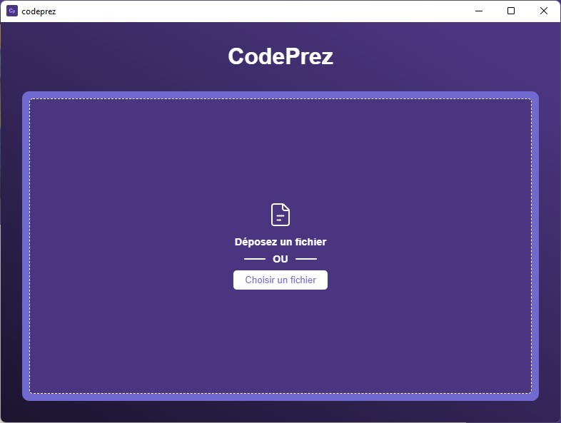
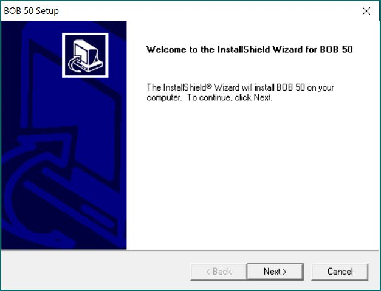
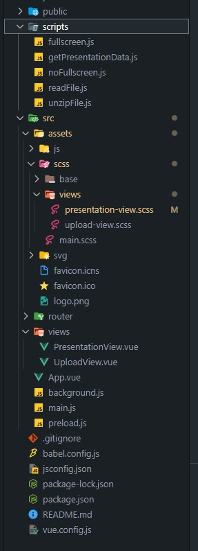

# Codeprez 👋

---

# 1. Introduction

Codeprez est une application electron qui permet de faire des présentations de type powerpoint avec un fichier readme.

---

# 3. Sommaire 📜

- Démonstration
- Code
- Conclusion

---

# 4. Démonstration

Pour commencer la présentation utilise le logiciel codeprez que nous avons développé. 👨‍💻

---

# 4. Démonstration

Après avoir lancé l'application, il suffit d'importer ou de glisser un fichier sur la fenêtre. 🧃

Une fois l'extraction du fichier, l'application se lance en fullscreen pour commencer la présentation. 🖼️

---

# 4. Démonstration

Démo installation + utilisation 🚀

---

# 5. Code

Architecture de l'application

---

# Conclusion

Projet terminé !

---

# Des questions ?